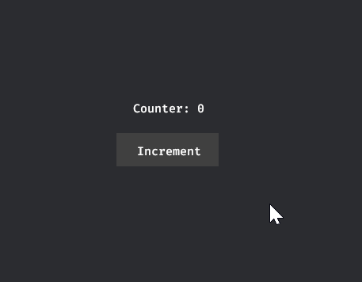
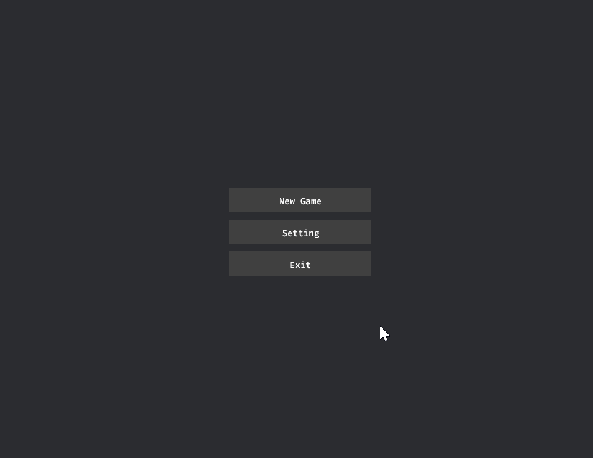

# Rxy UI

> 项目还在进行中，处于早期阶段，不建议在生产环境中使用。目前缺少大量测试用例。

受 [xilem](https://github.com/linebender/xilem) [tachys](https://github.com/gbj/tachys) 等项目的启发.

## 特征：

- 编译时视图、无过程宏：通过元组 Type Builder 的方式去构建视图、成员、样式
- 性能：视图默认仅构建一次，仅在反应式数据发生变化的可控范围里进行重新构建，采用了编译时视图，可以将数据全部放到在栈上
- 细粒度更新、支持信号 （fork 自 [tachy_reaccy](https://github.com/gbj/tachys/tree/main/tachy_reaccy)）
- 组件化：很容易将视图组件化，支持 静态属性、信号属性、事件、槽
- 控制流：支持 `x_if`、`x_iter`、`x_iter_keyed`、`x_iter_source` 等
- 层叠样式: 强类型，可共享，具有优先级，支持 `hover` `active` 交互样式

## 目标

- 灵活、可扩展
- 高复用、可组合
- 高性能、零成本抽象
- 最小的样板
- 支持多个渲染器 ( 目前只支持 [Bevy](https://github.com/bevyengine/bevy) )，使其能够应用在多种场景中，比如：游戏、桌面软件、裸机/嵌入式平台
  、本机 UI等
- 支持主流操作系统、Web 平台

## 计划

- Error Boundary、Suspense
- Text Edit
- 更多的 UI 组件 与 示例
- 更多 Debug 功能、更多的测试用例、Element inspector
- 其他渲染器
- bevy 更加深入的集成，作为场景来使用？（类似 `@react-three/fiber`），Schema 作为 Prefab ？
- 主题，tailwind
- DSL、样式热更新、动态样式
- 视图设计器

## 许可证

MIT License ([LICENSE-MIT](https://github.com/ycysdf/rxy_ui/blob/main/LICENSE-MIT))

## 贡献

欢迎共享代码！

## 使用

当前还没有发布 crate 到 crates.io

但是你可以指定 git 仓库依赖

```toml
[dependencies]
rxy_ui = { git = "https://github.com/ycysdf/rxy_ui", features = ["bevy"] }
bevy = { git = "https://github.com/bevyengine/bevy.git", branch = "main" }
```

## 示例

计数器



```rust
use bevy::prelude::*;
use rxy_ui::prelude::*;

fn main() {
    let mut app = App::new();
    app.add_plugins((
        DefaultPlugins,
        RxyPlugin::default(),
        RxyStyleSheetPlugin::default(),
    ))
    .add_systems(Startup, setup);

    app.run();
}

fn setup(mut commands: Commands) {
    commands.spawn(Camera2dBundle::default());
    commands.spawn_view_on_root(counter_by_signal());
}

fn counter_by_signal() -> impl IntoView<BevyRenderer> {
    let count = use_rw_signal(0);

    div().size_screen().flex().center().children(
        div().flex_col().items_center().gap(16).children((
            div().children(("Counter: ", rx(move || count.get().to_string()))),
            div()
                .children("Increment")
                .style((
                    x().px(16).py(8).bg_color(Color::DARK_GRAY),
                    x_hover().bg_color(Color::GRAY),
                    x_active().outline_color(Color::BLUE).outline_width(2),
                ))
                .on_pointer_click(move || count.update(|signal| *signal += 1)),
        )),
    )
}
```

自定义 Checkbox UI 组件

```rust
#[derive(TypedStyle)]
pub struct CheckboxStyle;

#[schema]
pub fn schema_checkbox(
    mut ctx: SchemaCtx,
    value: ReadSignal<bool>,
    readonly: ReadSignal<bool>,
    onchange: Sender<bool>,
) -> impl IntoElementView<BevyRenderer> {
    let is_checked = ctx.use_controlled_state(value, onchange);
    ctx.default_typed_style(CheckboxStyle, || {
        let size = 20;
        (
            x().center()
                .size(size)
                .border(1)
                .border_color(Color::DARK_GRAY),
            x_hover().bg_color(Color::DARK_GRAY),
        )
    });
    div()
        .name("checkbox")
        .style(CheckboxStyle)
        .bg_color(rx(move || is_checked.get().then_some(COLOR_PRIMARY)))
        .rx_member(move || {
            (!readonly.get()).then_some(().on_pointer_click(move || {
                is_checked.update(|is_checked| *is_checked = !*is_checked);
            }))
        })
}
```

游戏菜单与设置



> https://github.com/ycysdf/rxy_ui/blob/main/examples/game_ui_challenges/game_menu.rs

```rust
use bevy::prelude::*;
use rxy_bevy::navigation::RxyKeyboardNavigationPlugin;
use rxy_ui::prelude::*;

use bevy::app::AppExit;

use std::fmt::Debug;

mod checkbox;
mod select;
mod slider;

use checkbox::*;
use select::*;
use slider::*;

pub const COLOR_PRIMARY: Color = Color::BLUE;

#[derive(Clone, Copy, PartialEq, Eq, Hash, Debug, Default, States)]
enum GameState {
    #[default]
    MainMenu,
    Setting,
    InGame,
}

fn main() {
    let mut app = App::new();
    app.add_plugins((
        DefaultPlugins,
        RxyPlugin::default(),
        RxyStyleSheetPlugin::default(),
        RxyKeyboardNavigationPlugin::default(),
    ))
    .add_state::<GameState>()
    .add_systems(Startup, setup);

    app.run();
}

fn setup(mut commands: Commands) {
    commands.spawn(Camera2dBundle::default());
    commands.spawn_view_on_root(game_ui());
}

#[derive(TypedStyle)]
struct FocusStyle;

fn game_ui() -> impl IntoView<BevyRenderer> {
    (
        FocusStyle::def(
            x_focus()
                .outline_width(2)
                .outline_offset(2)
                .outline_color(COLOR_PRIMARY),
        ),
        x_res(|state: &State<GameState>| match state.get() {
            GameState::MainMenu => main_menu().into_dynamic(),
            GameState::Setting => setting().into_dynamic(),
            GameState::InGame => in_game().into_dynamic(),
        }),
    )
}

#[derive(Copy, Clone, Debug)]
pub struct XConfirm;

impl ElementEventIds for XConfirm {
    fn iter_event_ids(self) -> impl Iterator<Item = ElementEventId> + Send + 'static {
        (
            x_just_pressed(KeyCode::Return),
            x_just_pressed(GamepadButton::new(Gamepad::new(1), GamepadButtonType::West)),
            x_pointer_click(),
        )
            .iter_event_ids()
    }
}

#[schema]
fn schema_main_menu() -> impl IntoView<BevyRenderer> {
    #[derive(TypedStyle)]
    struct MenuBtnStyle;

    (
        MenuBtnStyle::def((
            x().width(160)
                .py(8)
                .flex()
                .center()
                .bg_color(Color::DARK_GRAY),
            x_hover().bg_color(Color::GRAY),
            x_active().bg_color(COLOR_PRIMARY),
            FocusStyle,
        )),
        div().style(x().size_screen().center()).children(
            div().style(x().flex_col().gap(8).padding(20)).children({
                (
                    button().style(MenuBtnStyle).children("New Game").on(
                        XConfirm,
                        |mut next_state: ResMut<NextState<GameState>>| {
                            next_state.set(GameState::InGame);
                        },
                    ),
                    button().style(MenuBtnStyle).children("Setting").on(
                        XConfirm,
                        |mut next_state: ResMut<NextState<GameState>>| {
                            next_state.set(GameState::Setting);
                        },
                    ),
                    button().style(MenuBtnStyle).children("Exit").on(
                        XConfirm,
                        |mut app_exit: EventWriter<AppExit>| {
                            app_exit.send(AppExit);
                        },
                    ),
                )
            }),
        ),
    )
}

#[schema]
fn schema_setting() -> impl IntoView<BevyRenderer> {
    let options = ["Option 1", "Option 2", "Option 3"];

    fn setting_item(
        label: impl IntoView<BevyRenderer>,
        content: impl IntoView<BevyRenderer>,
    ) -> impl IntoView<BevyRenderer> {
        div()
            .style((
                x().flex()
                    .min_h(45)
                    .justify_between()
                    .items_center()
                    .gap(20)
                    .py(8)
                    .px(16),
                x_hover().bg_color(Color::rgba(0.25, 0.25, 0.25, 0.4)),
            ))
            .children((label, content))
    }

    fn label(str: impl Into<String>) -> impl IntoView<BevyRenderer> {
        span(str.into()).font_size(17.)
    }

    div().style(x().size_screen().center()).children(
        div().style(x().min_w(500).gap(8).flex_col()).children((
            span("Game Setting").font_size(24.).mb(20),
            setting_item(
                label("Select"),
                select::<&'static str>()
                    .value(options[0])
                    .slot_content(view_builder(move |_, _| {
                        x_iter(options.map(|n| {
                            selection_item(n, |item| {
                                button()
                                    .style((
                                        x().flex().py(6).center(),
                                        x_hover().bg_color(Color::DARK_GRAY),
                                        FocusStyle,
                                    ))
                                    .bg_color(item.is_selected.then_some(Color::BLUE))
                                    .children((item.value,))
                            })
                        }))
                    })),
            ),
            setting_item(
                label("CheckBox"),
                checkbox().value(true).onchange(|_value| {
                    println!("checkbox value: {}", _value);
                }),
            ),
            setting_item(label("Slider"), slider().value(0.3)),
            setting_item(label("Select Item"), {
                let section_item = |item: SelectionItem<&'static str>| {
                    button()
                        .style((
                            x().flex().py(8).px(16).center(),
                            x_hover().bg_color(Color::DARK_GRAY),
                            FocusStyle,
                        ))
                        .bg_color(item.is_selected.then_some(Color::BLUE))
                        .children((item.value,))
                };
                selection_list::<&'static str>()
                    .style(x().flex_row().py(4))
                    .value("One")
                    .slot_content((
                        selection_item("One", section_item),
                        selection_item("Two", section_item),
                    ))
            }),
        )),
    )
}

#[schema]
fn schema_in_game() -> impl IntoView<BevyRenderer> {
    div()
        .style(x().size_screen().center().flex_col().gap(8))
        .children("InGame")
}
```

## 更多示例

- 计数器：[examples/counter](examples/counter.rs)
- [Bevy UI 框架的 10 个挑战](https://github.com/bevyengine/bevy/discussions/11100)
    - 1. 游戏菜单与自定义 UI 组件：[examples/game_ui_challenges/game_menu](examples/game_ui_challenges/game_menu.rs)
    - 2. 游戏库存：[examples/game_ui_challenges/inventory](examples/game_ui_challenges/inventory.rs)
    - `todo!()`
- [7GUIs](https://eugenkiss.github.io/7guis/)
    - `todo!()`
- TodoList: `todo!()`

## 教程

### 基础

Rxy UI 的视图由 `View` 元组组合而成。所有实现了 `IntoView` 的类型都可以作为视图的一部分。

只要元组的成员全部实现了 `View`，那么该元组也实现了`View`，通过这样来组合视图

字符串实现了 `IntoView`，所以可以直接放入视图中。

`div` 是最常用的视图类型（ 相当与 Bevy 中的 `NodeBundle`，也类似于 HTML 中的 div ）

```rust
fn my_view() -> impl IntoView<BevyRenderer> {
    (
        div().children("Hello World"),
        "Hello World",
    )
}
```

通过链式调用向 `View` 类型添加成员，`children` 方法用于设置视图的子视图

可以通过`width`、`height`、`flex`、`border`、`outline` 等等去设置视图的属性

>
目前支持的全部属性请看：[attrs](https://github.com/ycysdf/rxy_ui/blob/main/crates/rxy_bevy/src/renderer/attrs.rs),[composite_attrs](https://github.com/ycysdf/rxy_ui/blob/main/crates/rxy_bevy/src/renderer/composite_attrs.rs),[tailwind_attrs](https://github.com/ycysdf/rxy_ui/blob/main/crates/rxy_bevy/src/renderer/tailwind_attrs.rs)
.基本 NodeBundle 里面成员都有对应的属性

所有实现了 `ViewMember` 的类型都可以作为视图的成员，可通过 `member` 方法来手动添加成员

与 `View`一样，只要元组的成员全部实现了 `ViewMember`，那么该元组也实现了`ViewMember`

```rust
fn my_view() -> impl IntoView<BevyRenderer> {
    let my_member = ().width(100).height(100);
    (
        div().member(my_member.clone()),
        div().member(my_member)
    )
}
```

`View` 描述了视图所需的数据，一个普通的`View`只有属性值，其他的`View`则额外包含一些额外信息，仅此而已，它并不是真正的视图节点。

得利于类型化的编译时视图，这些数据属性值可全部放在栈上，所以它的开销很低。

### 事件

可以通过 `on_pointer_click`、等方法来添加事件，传入的回调函数是个 Bevy `System`
，也就是说可以使用 `Res`、`Commands`、`EventWriter` 等作为它的参数。

```rust
fn signal_example()-> impl IntoView<BevyRenderer> {
    div().children("Button")
        .on_pointer_click(|res: Res<TestRes>, event_writer: EventWriter<TestEvent>, commands: Commands| {
            println!("click")
        })
}
```

### 信号

> 当前信号的[实现](https://github.com/ycysdf/xy_reactive) fork
> 自 [tachy_reaccy](https://github.com/gbj/tachys/tree/main/tachy_reaccy)，它是 leptos 的下一代信号库，信号的用法基本与
> leptos_reactive 类似

Rxy UI 支持使用信号来重新构建视图与其成员。

一个重要的函数是`rx`，它要求传入一个闭包，在此闭包中可以使用信号的 `get` 方法来获取信号的值，`rx` 返回一个 `Reactive`类型

当信号的值发生变化时，将重新构建 `View`或`ViewMember`

如果闭包返回值实现了 `IntoView`，那么此`Reactive`类型就实现了 `View`, `rx`函数就可以直接在视图中使用


此外如果信号类型`RwSignal<T>`或`ReadSignal<T>` `T` 实现了 `IntoView`，那么它也实现了 `View`

```rust
fn signal_example() -> impl IntoView<BevyRenderer> {
    let count = use_rw_signal(0);
    div()
        .children(rx(move || count.get().to_string())) // `Reactive` 作为 `View`
        .padding(20)
        .bg_color(Color::BLUE)
        .border_y(count) // 直接将 `RwSignal` 信号 作为 `ViewMember`
        .border_color(Color::RED)
        .width(100)
        .height(rx(move || count.get() * 4 + 100)) // `Reactive` 作为 `ViewMember`
        .on_pointer_click(move || {
            count.update(|x| *x += 1);
        })
}
```

### Option、Either、Stream、Future

如果`IntoView`，`Option<T>`、`Either<A, B>`、`Stream<T>`、`Future<T>`的泛型参数实现了 `IntoView`，那么它们本身也实现了 `IntoView`

例如：`String`、`&'static str` 实现了`IntoView`，`Option<String>`、`Future<Option<String>>` 等也都实现了 `IntoView`，它们是可以嵌套的

视图成员（或者它能接受的值）也同理，如果`T`本身可以作为视图成员，那么`Option<T>`、`Future<Option<T>>` 等也可以直接作为视图成员

例如：`div().width(10)` 中其中值：`10` 是 `width` 成员可以接受的值，那么 `Some(10)`、`async {Some(10)}` 等也可以直接作为成员的值

> `width` 能直接接受值： `10` (等同于 `Val::Px(10.)`)、`10.` (等同于 `Val::Px(10.)`)、`Val::Percent(100)` 等

下面是它们的一些用例

`Option` 用例：控制是否去构建 视图 或 视图成员

> 虽然 rx 配合 Option 可以实现控制视图的显示，但是 `x_if` 是更好的选择，之后会介绍

```rust
fn btn(is_show: RwSignal<bool>) -> impl IntoView<BevyRenderer> {
    div()
        .children("Btn")
        .padding(20)
        .bg_color(Color::GRAY)
        .on_pointer_click(move || {
            is_show.update(|x| *x = !*x);
        })
}

fn sample_option_view() -> impl IntoView<BevyRenderer> {
    let is_show = use_rw_signal(false);
    (
        btn(is_show),
        rx(move || {
            let view = div()
                .padding(10)
                .bg_color(Color::BLUE)
                .flex()
                .center()
                .children("Show");
            if is_show.get() {
                Some(view)
            } else {
                None
            }

            // is_show.get().then_some(view) 这种写法也可以
        }),
    )
}

fn sample_option_view_member() -> impl IntoView<BevyRenderer> {
    let is_show = use_rw_signal(false);
    (
        btn(is_show),
        div()
            .padding(10)
            .flex()
            .center()
            .children("Show")
            .member(rx(move || {
                is_show.get().then_some(
                    ().bg_color(Color::BLUE)
                        .outline_color(Color::RED)
                        .outline_width(2),
                )
            }))
            // 下面写法与上面写法是等价的
            // .rx_member(move || {
            //     is_show.get().then_some(
            //         ().bg_color(Color::BLUE)
            //             .outline_color(Color::RED)
            //             .outline_width(2),
            //     )
            // }),
    )
}
```

`Either` 用例：选择构建的 视图 或 视图成员

> 虽然 rx 配合 Either 可以实现控制视图的切换，但是 `x_if_else` 是更好的选择，之后会介绍

```rust
fn sample_either_view() -> impl IntoView<BevyRenderer> {
    let is_show = use_rw_signal(false);
    (
        btn(is_show),
        rx(move || {
            let left_view = "Left";
            let right_view = "Right";
            if is_show.get() {
                left_view.either_left() // 这等同于 Either::Left(left_view)
            } else {
                right_view.either_right() // 这等同于 Either::Right(right_view)
            }
        }),
    )
}

fn sample_either_view_member() -> impl IntoView<BevyRenderer> {
    let is_show = use_rw_signal(false);
    (
        btn(is_show),
        div()
            .padding(10)
            .flex()
            .center()
            .children("Show")
            .member(rx(move || {
                let left_vm = ().bg_color(Color::BLUE);
                let right_vm = ().outline_color(Color::RED).outline_width(2);
                if is_show.get() {
                    left_vm.either_left() // 这等同于 Either::Left(left_vm)
                } else {
                    right_vm.either_right() // 这等同于 Either::Right(right_vm)
                }
            }))
    )
}
```

`Future` 用例：

```rust
fn sample_future() -> impl IntoView<BevyRenderer> {
    let (sender, receiver) = oneshot::channel();
    let mut sender = SyncCell::new(Some(sender));

    let (sender2, receiver2) = async_channel::unbounded();

    (
        div()
            .padding(20)
            .bg_color({
                let receiver2 = receiver2.clone();
                async move { receiver2.recv().await.unwrap() }.boxed()
            })
            .children("Ok")
            .on_pointer_click(move || {
                let _ = sender2.try_send(Color::RED);
                if let Some(sender) = sender.get().take() {
                    sender.send("Ok").unwrap();
                }
            }),
        // 非 Boxed Future 使用 x_future
        x_future(async {
            let r = receiver.await;
            div().padding(20).children(format!("Future: {:?}", r))
        }),
        // Boxed Future 可以直接作为 View
        async move {
            let color = receiver2.recv().await;
            div().padding(20).children(format!("Color: {:?}", color))
        }
        .boxed(),
    )
}
```

`Stream` 用例：

[counter_by_channel](examples/counter_by_channel.rs)

### 控制流：x_if、x_iter、x_iter_keyed、x_iter_source

`x_if` 用于控制是否构建对应视图，`x_if`传入的第一个参数 与 视图成员类似，可以是 `bool`、`Reactive`、`ReadSingal` 等

```rust
fn sample_x_if() -> impl IntoView<BevyRenderer> {
    let is_show = use_rw_signal(false);
    (
        div()
            .children("Btn")
            .padding(20)
            .bg_color(Color::GRAY)
            .on_pointer_click(move || {
                is_show.update(|x| *x = !*x);
            }),
        x_if(is_show, span("Show1").padding(10).text_color(Color::RED)),
        x_if(
            is_show,
            div().padding(10).flex().center().children("Show2"),
        ),
    )
}
```

`x_iter` 用于构建列表视图，它接收`IntoIterator`，并且`Item` 需要实现 `IntoView`，它将项的索引作为 key

`x_iter_keyed` 则需要手动指定 key，需要 `Item` 为 `Keyed<K,IV>` 类型，它由两个成员，第一个为 key (要求实现 `Hash`)，第二个为视图

```rust 
fn sample_x_iter() -> impl IntoView<BevyRenderer> {
    div()
        .flex_col()
        .gap(8)
        .children(x_iter((0..10).map(|n| format!("Item: {}", n))))
}

fn sample_x_iter_keyed() -> impl IntoView<BevyRenderer> {
    div()
        .flex_col()
        .gap(1)
        .children(x_iter_keyed((0..25).map(|n| {
            Keyed(
                n,
                span(format!("Item: {}", n))
                    .padding(10)
                    .text_color(Color::rgb_u8(n * 10, 0, 0)),
            )
        })))
}
```

如果你需要更新列表，你可以使用 `rx` 包裹它

```rust
fn sample_x_iter_keyed_rx() -> impl IntoView<BevyRenderer> {
    let signal = use_rw_signal(3);
    (
        div()
            .padding(10)
            .bg_color(Color::BLUE)
            .children("Add")
            .on_pointer_click(move || {
                signal.update(|x| *x += 1);
            }),
        rx(move || {
            div()
                .flex_col()
                .gap(1)
                .children(x_iter_keyed((0..signal.get()).map(|n| {
                    Keyed(
                        n,
                        span(format!("Item: {}", n))
                            .padding(10)
                            .text_color(Color::rgb_u8(n * 2, 255, 255)),
                    )
                })))
        }),
    )
}
```

对于会频繁进行更改的列表视图，你还可以使用 `x_iter_source`与`use_list`，它比 `x_iter_keyed` 更加擅长更新列表，并且性能很好

```rust
fn ui() -> impl IntoView<BevyRenderer> {
    let (ops, source) = use_list([1, 2, 3]);

    let container_style = x()
        .flex()
        .size_screen()
        .gap(16)
        .py(16)
        .justify_center()
        .items_start();

    #[derive(TypedStyle)]
    struct BtnStyle;

    (
        BtnStyle::def((
            x().py(8).px(16).center().bg_color(Color::DARK_GRAY),
            x_hover().bg_color(Color::GRAY),
        )),
        div().style(container_style).children((
            div().flex_col().gap(8).children((
                div().children("Push").style(BtnStyle).on_pointer_click({
                    let ops = ops.clone();
                    move || {
                        ops.callback(|vec| {
                            vec.push(vec.len() as u32);
                        });
                    }
                }),
                div()
                    .children("Update First")
                    .style(BtnStyle)
                    .on_pointer_click({
                        let ops = ops.clone();
                        move || {
                            ops.callback(|vec| {
                                if vec.is_empty() {
                                    return;
                                }
                                vec.update(0, 100);
                            });
                        }
                    }),
                div()
                    .children("Patch Last")
                    .style(BtnStyle)
                    .on_pointer_click({
                        let ops = ops.clone();
                        move || {
                            ops.callback(|vec| {
                                if vec.is_empty() {
                                    return;
                                }
                                let last = vec.len() - 1;
                                vec.update(last, vec[last] + 10)
                            })
                        }
                    }),
                div().children("Pop").style(BtnStyle).on_pointer_click({
                    let ops = ops.clone();
                    move || {
                        ops.pop();
                    }
                }),
                div().children("Clear").style(BtnStyle).on_pointer_click({
                    let ops = ops.clone();
                    move || {
                        ops.clear();
                    }
                }),
            )),
            div().flex_col().gap(8).children((
                "--Header--",
                x_iter_source(source, |n,_| n.to_string()),
                "--Footer--",
            )),
        )),
    )
}
```

### 层叠样式

之前用例中的属性样式都是直接写在视图上的，这样的样式是无法层叠的。虽然可以覆盖（但是也存在一些问题）并且不支持 悬浮与按下(
激活) 等交互样式。

而层叠样式是可以层叠的，它们有优先级，包括直接设置属性，它们的优先级如下：

直接设置属性 > 交互样式 > 内联样式 > 共享样式 > 位置靠后的样式

使用 `style` 方法添加样式，与 `View`、`ViewMember` 类似，它接受一个元组，里面可以填写多个样式表

普通样式使用 `x()` 来构造，交互样式使用 `x_hover()`、`x_active()`、`x_focus()` 等来构造

```rust
fn sample_style_sheet() -> impl IntoView<BevyRenderer> {
    div()
        .margin(50)
        .style((
            x().py(8 * 2).px(16 * 2).center().bg_color(Color::DARK_GRAY),
            x_hover().bg_color(Color::GRAY),
            x_active().outline_color(Color::GREEN).outline_width(2),
        ))
        .children("Button")
}
```

目前样式表里面的样式都是静态的，不允许使用`rx`、`Future`、`Stream`、`Option` 等，但是你可以多次调用 `style` 方法来添加样式，

`style` 与其他成员一样可以接受 `Reactive`、`Future`、`Option`、`Stream` 等类型

```rust
fn sample_dynamic_style_sheet() -> impl IntoView<BevyRenderer> {
    let signal = use_rw_signal(false);
    div()
        .on_pointer_click(move || {
            signal.update(|n| *n = !*n);
        })
        .style(Some((x().bg_color(Color::GRAY).height(100.).width(100.),)))
        .rx_style(move || {
            signal
                .get()
                .then_some((x().bg_color(Color::RED), x_hover().bg_color(Color::WHITE)))
        })
}
```

### 共享的类型化层叠样式

通过在结构上使用 derive 宏 `TypedStyle` 去定义一个共享样式标识，然后在视图里调用 `def` 方法来定义一个共享的类型化层叠样式

要使用共享样式，直接调用 `style` 方法并传入此类型即可

```rust
fn sample_shared_typed_style_sheet() -> impl IntoView<BevyRenderer> {
    #[derive(TypedStyle)]
    struct MenuBtnStyle;
    (
        MenuBtnStyle::def((
            x().width(160)
                .py(8)
                .flex()
                .center()
                .bg_color(Color::DARK_GRAY),
            x_hover().bg_color(Color::GRAY),
            x_active().outline_color(Color::GREEN).outline_width(2),
        )),
        div().padding(50).gap(10).flex_col().children((
            div().style(MenuBtnStyle).children("Button 1"),
            div()
                .style((MenuBtnStyle, x().bg_color(Color::RED)))
                .children("Button 2"),
            div().style(MenuBtnStyle).children("Button 3"),
        )),
    )
}
```

> 目前共享样式表的样式不能修改手段，后续将增加修改的手段

### Schema ( 组件化 )

首先，你可以直接通过函数来重用视图。但是有以下问题：

- Rust 无可选参数
- 函数可能调用多次（如果处于 rx 中，那么每次信号变化都会调用一次）
- 只是一个普通的函数，没有上下文，不好进行一些封装
- 还有一些其他问题，就不多赘述

所以，我们需要一种更好的方式来重用视图，这就是 `Schema`，这是暂定名称，如果你有更好的名称，欢迎提出。

> 这个名称最好是单个单词，不使用 Component 是因为它已经被 ECS 暂用了。不用 Widget 是因为后续我准备将它用于自绘的控件。

> 后续将探索是否可以把 Schema 作为 游戏场景的 Prefab 预制件来使用

`Schema` 基本解决了 上述提出的全部问题:

- `Schema` 保证了函数只会运行一次，也就是说里面的视图只会构建一次。
- 默认属性都是可选的，也支持必填属性
- 支持 槽、事件、上下文等等

定义 `Schema` 的约定:

- 使用属性宏 `schema`
- 函数名以 `schema_` 开头
- 返回值类型只能是 `impl IntoView<渲染器>` 或 `impl IntoElementView<渲染器>`（后面将介绍 `IntoElementView`与 `IntoView`
  的区别）
- 有效的参数类型，通过函数的参数来定义 `Schema` 的属性、事件、槽 等

有以下种类的属性：

- `ReadSignal`：信号
- `ReceiverProp`：简单的反应式属性，目前不推荐使用，主要是因为它相对与信号来说，功能弱且没有信号好用。
- `Static`：静态属性，不会更新

默认情况下，属性都是可选的，如果你想要必须传入，可以使用 `Required` 将类型包裹起来 ( 后面会详细介绍 )

事件类型：`Sender`，这表示一个事件 ( 实际上它是 `async-channel` 的 `Sender` 类型的重新导出 )

槽类型：`Slot`, 一个槽，`CloneableSlot`, 一个可以克隆的槽，槽实现了 `IntoView`，所以可以直接放入视图中

`SchemaCtx`：上下文类型, 目前可以使用它:

- 来获取 `World`
- 在视图外定义共享样式或者默认共享样式
- `use_controlled_state` 来获取一个受控的状态

下面是 自定义 `Checkbox` 的代码示例：

```rust
#[derive(TypedStyle)]
pub struct CheckboxStyle;

#[schema]
pub fn schema_checkbox(
    mut ctx: SchemaCtx,
    value: ReadSignal<bool>,
    readonly: ReadSignal<bool>,
    onchange: Sender<bool>,
) -> impl IntoElementView<BevyRenderer> {
    let is_checked = ctx.use_controlled_state(value, onchange); // 获取一个受控的状态
    ctx.default_typed_style(CheckboxStyle, || { // 定义默认共享样式
        let size = 20;
        (
            x().center()
                .size(size)
                .border(1)
                .border_color(Color::DARK_GRAY),
            x_hover().bg_color(Color::DARK_GRAY),
        )
    });
    div()
        .name("checkbox")
        .style(CheckboxStyle)
        .bg_color(rx(move || is_checked.get().then_some(Color::BLUE)))
        .rx_member(move || {
            (!readonly.get()).then_some(().on_pointer_click(move || {
                is_checked.update(|is_checked| *is_checked = !*is_checked);
            }))
        })
}
```

> 如果你在属性中使用了你的自定义类型，比如 `ReadSignal<CustomType>`，那么你需要添加 `PropValueWrapper` derive
> 宏到 `CustomType`，后续可能会去掉这个限制

在上面示例中使用了 `use_controlled_state`，它通过传入信号与事件，返回一个新的信号。

当传入的信号 或者 返回的信号发生改变时，就会发送事件，将最新的值作为参数。

`schema` 属性宏做了什么？它没有修改原函数，它根据函数信息，生成了一个新的函数，原函数去除`schema_`
前缀就是它的名字，并且为这个函数的返回值类型添加了一个 `Trait` 实现 ( 详细请可以查看宏生成的代码 )

看下面它的使用示例：

```rust
fn sample_checkbox() -> impl IntoView<BevyRenderer> {
    checkbox()
        .padding(50)
        .style(x().border_color(Color::RED).border(2))
        .on_pointer_up(|| {
            println!("checkbox pointer up");
        })
        .value(false)
        .readonly(false)
        .onchange(|value| {
            println!("checkbox value: {}", value);
        })
}
```

`checkbox` 函数就是通过`schema_checkbox` 生成的函数。

可以向 `schema_checkbox` 的根元素传入 `padding`、`style`、`on_pointer_up` 等等属性或事件，这些属性或事件会传递给根元素。

除了它们，还有 `value`、`readonly`、`onchange` 等属性，通过它们去设置 `schema_checkbox` `Schema` 的同名属性或者事件

属性除了接受静态值。你也可以使用 `Option` 与 `Reactive`、`ReadSignal`等反应式类型 对值进行包装

> 与 `ViewMember` 不同, Schema 属性 目前无法在 `Reactive`、`Memo` 等反应式类型里面嵌套 `Option`

### IntoView 与 IntoElementView 的区别

`IntoView` 中根元素可以有 0 到 多个，而`IntoElementView` 只能有 1个根元素

如果 `Schema` 返回类型是 `IntoView` 则外部无法向它的根元素追加成员或事件，因为它的根元素可能有多个，也可能没有

### Schema 槽

在 `Schema` 中定义槽后，就可以使用 `slot_<槽名称>` 方法去指定槽的内容，它接收 `IntoView` 类型，如果槽是 `CloneableSlot`
类型，那么它接收的 `IntoView` 类型需要实现 `Clone` （许多视图都没有实现 `Clone`
，就像前面说的，遇到这种情况，你可以使用 `viwe_builder` 来包裹它）

代码示例：

```rust
#[schema]
fn schema_sample(head: Slot, foot: Slot) -> impl IntoView<BevyRenderer> {
    div()
        .children((
            head,
            div().bg_color(Color::GRAY).p(20).children("Body"),
            foot,
        ))
        .p(20)
        .flex_col()
        .gap(8)
}

fn sample_schema_sample() -> impl IntoView<BevyRenderer> {
    sample()
        .slot_head(div().children("Head"))
        .slot_foot(div().children("Foot"))
}
```

### Schema Required

默认情况下，`Schema` 的属性都是可选的，所以属性值的类型如 `ReadSignal<T>` 中的 `T` 必须实现 `Default`

你可以对 `Static`、`ReadSignal`、`ReceiverProp`、`Slot`、`CloneableSlot` 等属性使用 `Required`
来包裹它，以表示它是必填，属性值类型 `T` 就不必实现 `Default` 了

指定为必填后，`Schema` 生成的函数将不再是无参的，而是需要你按照必填参数的顺序依次传入

代码示例：

```rust
#[schema]
fn schema_required_sample(
    Required(content): Required<Slot>,
    Required(static_p): Required<Static<bool>>,
) -> impl IntoView<BevyRenderer> {
    div().children((content, "schema_required_sample"))
}

fn sample_schema_required_sample() -> impl IntoView<BevyRenderer> {
    required_sample("Content Slot", true)
}
```

### dynamic

有时需要返回不同的类型，而 `impl` 不允许返回不同的类型

对于两种不同的类型，你可以使用 `Either<LeftView, RightView>` 来包裹它们去解决问题，

对于多种不同的类型，你也可以使用 `Either<LeftView, Either<RightView, Either<...>>>` 这种 `Either` 嵌套来解决此问题，但是这样写起来太繁琐了

这时，你可以使用 `into_dynamic()` 将 `IntoView` 转换为动态视图来解决此问题

> 注意: `View` 的类型包裹了 `ViewMember`，也就是说 `ViewMember` 成员不同，也会导致 `View` 类型不同

代码示例：

```rust
#[derive(Clone, Debug)]
enum SampleState {
    Init,
    Loading,
    Loaded,
}

fn sample_dynamic() -> impl IntoView<BevyRenderer> {
    let signal = use_rw_signal(SampleState::Init);
    (
        div()
            .children("Change State")
            .style((
                x().padding(20).flex().center().bg_color(Color::DARK_GRAY),
                x_hover().bg_color(Color::GRAY),
                x_active().outline_color(Color::GREEN).outline_width(2),
            ))
            .on_pointer_click(move || {
                signal.update(|state| match state {
                    SampleState::Init => *state = SampleState::Loading,
                    SampleState::Loading => *state = SampleState::Loaded,
                    SampleState::Loaded => *state = SampleState::Init,
                })
            }),
        rx(move || match signal.get() {
            SampleState::Init => span("Init").margin(30).into_dynamic(),
            SampleState::Loading => div()
                .padding(30)
                .bg_color(Color::RED)
                .children("Loading")
                .into_dynamic(),
            SampleState::Loaded => span("Loaded")
                .margin(30)
                .text_color(Color::BLUE)
                .into_dynamic(),
        }),
    )
}
```

### Bevy `system_once`

`system_once` 会在构建它时会运行传入的`System`一次 ( 如果在 `rx` 中，那么每次信号变化都会运行一次 )

```rust
fn sample_system_once() -> impl IntoView<BevyRenderer> {
    system_once(|entities: &Entities, cmd_sender: Res<CmdSender>| {
        let cmd_sender = cmd_sender.clone();
        (
            div()
                .font_size(30)
                .children(format!("Entites Count: {}", entities.len())),
            div()
                .children("Spawn 2d Material")
                .style((
                    x().padding(20).flex().center().bg_color(Color::DARK_GRAY),
                    x_hover().bg_color(Color::GRAY),
                    x_active().outline_color(Color::GREEN).outline_width(2),
                ))
                .on_pointer_click(move || {
                    cmd_sender.add(|world: &mut World| {
                        let mut meshes = world.resource_mut::<Assets<Mesh>>();
                        let mesh = meshes.add(shape::Quad::default().into()).into();

                        let mut materials = world.resource_mut::<Assets<ColorMaterial>>();
                        let material = materials.add(Color::PURPLE.into());

                        world.spawn(MaterialMesh2dBundle {
                            mesh,
                            transform: Transform::default().with_scale(Vec3::splat(128.)),
                            material,
                            ..default()
                        });
                    });
                }),
        )
    })
}
```

### Bevy `system`

通过使用 `system`，你可以将 Bevy `System` 作为视图。可以使用 `configure` 配置 `System`

但是此方法当前是 `unsafe` 的，因为当前在 Bevy 里没有删除 `System` 的手段，所以你得保证这个视图一直存在

```rust
fn sample_system() -> impl IntoView<BevyRenderer> {
    div().flex_col().gap(10).children(unsafe {
        system_with_config(Update,|config| config.run_if(|| true), |query: Query<Entity, With<Style>>| {
            x_iter_keyed(query.iter().map(|entity| {
                Keyed(
                    entity,
                    span(format!("Style Entity: {:?}", entity)).margin(10),
                )
            }))
        })
    })
}
```

### Bevy `x_res`

`x_res` 获取 `T` 类型的资源，并在资源变化时重新构建

如下代码示例，每当 `FrameCount` 资源变化时，都会重新构建视图：

```rust
fn sample_x_res() -> impl IntoView<BevyRenderer> {
    div().gap(10).p(20).flex_col().children((
        x_res(|frame_count: &FrameCount| {
            span(format!("FrameCount: {:?}", frame_count.0))
                .p(20)
                .font_size(30)
        }),
    ))
}
```

### Bevy `Bundle`

通过 `x_bundle` 方法包裹 Bevy `Bundle` 将得到 `XBundle<T>`，它实现了 `ViewMember`，所以你可以把 `Bundle` 作为视图成员放入视图中

还提供了 `.bundle(YourBundle)` 链式调用方法，它等同于 `.member(x_bundle(YourBundle))`

当然你也可以使用 `rx` 将 `XBundle` 包裹起来

代码示例：

```rust
fn sample_bundle() -> impl IntoView<BevyRenderer> {
    let signal = use_rw_signal(false);

    #[derive(Component)]
    struct CustomComponent;
    #[derive(Component)]
    struct CustomComponent2(bool);
    #[derive(Component)]
    struct CustomComponent3;
    
    div()
        .bundle(CustomComponent3) // 等同于：`.member(x_bundle(CustomComponent))`
        .rx_member(move || signal.get().then_some(x_bundle(CustomComponent))) // `rx_member()` 等同于 `member(rx())`
        .rx_member(move || x_bundle(CustomComponent2(signal.get())))
}
```

### view_builder

`view_builder` 视图构建器 接受一个回调函数，此回调函数接受两个参数，第一个参数是 `ViewCtx`，第二个参数是 `BuildFlags`.

`view_builder` 可以在回调中使用`ViewCtx`去构建你的视图

前面也说过，`view_builder`还可以让不能 `Clone` 的 `View` 放入 `view_builder` 中，`view_builder` 返回的类型实现了`Clone`

```rust
fn sample_view_builder() -> impl IntoView<BevyRenderer> {
    view_builder(|ctx, flags| {
        let parent = ctx.parent;
        // let world = ctx.world;
        format!("Parent: {:?}, Flags: {:?}", parent, flags)
    })
}
```

### `provide_context`

可以通过 `provide_context` 来提供上下文，它将上下文类型提供给它的子视图

子视图可以通过 `view_builder` 的第一个参数 `ViewCtx` 的 `context`相关方法 来获取上下文

在 `Schema` 中，你可以直接通过 `Context`参数来获取上下文

示例：

```rust
#[derive(TypedStyle)]
struct BtnStyle;
#[derive(Clone)]
struct MyContext {
    signal: RwSignal<bool>,
}

#[schema]
fn schema_context_sample(Context(my_context): Context<MyContext>) -> impl IntoView<BevyRenderer> {
    div()
        .children("Set Signal To True")
        .style(BtnStyle)
        .on_pointer_click(move || {
            my_context.signal.set(true);
        })
}

fn sample_context() -> impl IntoView<BevyRenderer> {
    let signal = use_rw_signal(false);
    (
        BtnStyle::def((
            x().width(160)
                .py(8)
                .flex()
                .center()
                .bg_color(Color::DARK_GRAY),
            x_hover().bg_color(Color::GRAY),
            x_active().outline_color(Color::GREEN).outline_width(2),
        )),
        provide_context(
            MyContext { signal },
            div().p(20).flex().gap(10).children((
                view_builder(|ctx, _| {
                    let my_context = ctx.context::<MyContext>();
                    rx(move || format!("Signal: {}", my_context.signal.get()))
                }),
                x_if(signal, "Signal Is True"),
                div()
                    .children("Set Signal To False")
                    .style(BtnStyle)
                    .on_pointer_click(move || {
                        signal.set(false);
                    }),
                context_sample(),
            )),
        ),
    )
}
```

### 泛型 Schema

`schema` 支持函数去使用泛型参数

示例：

```rust
#[schema]
fn schema_select<T>(
    mut ctx: SchemaCtx,
    content: CloneableSlot,
    value: ReadSignal<T>,
    readonly: ReadSignal<bool>,
    onchange: Sender<T>,
) -> impl IntoElementView<BevyRenderer>
where
    T: Default + Debug + Send + Sync + PartialEq + Clone + 'static,
{
    ///...
}

fn sample_schema_select() -> impl IntoView<BevyRenderer> {
    enum SelectValue {
        A,
        B,
        C,
    }
    schema_select::<SelectValue>()
    // ...
}
```

[//]: # (### 静态与动态上下文)

[//]: # (### View、IntoView)

[//]: # (### MutableView)
[//]: # (### 关于 Attr，Tailwind Attr，Val,Flex,Grid)